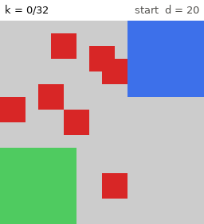

# meda-gnn-routing

**Reliable droplet routing on MEDA biochips, from deep reinforcement learning to graph neural networks.**

This repository is the base of our B.Tech project (BTP) on **GNN-based droplet
routing for micro-electrode-dot-array (MEDA) digital microfluidic biochips**.
Its first milestone is a faithful, tested reimplementation of the base paper:

> M. Elfar, Y.-C. Chang, H. H.-Y. Ku, T.-C. Liang, K. Chakrabarty, M. Pajic,
> **"Deep Reinforcement Learning-Based Approach for Efficient and Reliable
> Droplet Routing on MEDA Biochips"**, *IEEE Transactions on Computer-Aided
> Design of Integrated Circuits and Systems*, vol. 42, no. 4, pp. 1212–1222,
> April 2023. doi: [10.1109/TCAD.2022.3194808](https://doi.org/10.1109/TCAD.2022.3194808)

The code uses Python, Gymnasium, Stable-Baselines3 and PyTorch. The original
used TF1 and stable-baselines v2.

## The problem in brief

A MEDA biochip moves nanoliter droplets over a grid of thousands of
microelectrodes (MCs) using electrowetting. MCs degrade as they are actuated
(charge trapping), and a degraded MC produces a weaker force, so droplets
moving over it may get stuck. MEDA chips can *sense* each MC's health in real
time. The paper trains a PPO agent with a CNN policy that reads the health
map and steers each droplet around degraded regions. The agent uses an
8-direction action space whose step size adapts to the droplet size.

<p align="center">
  
</p>
<p align="center"><sub>A trained agent (16×16 chip, 10% faults) routes a 6×6 droplet (blue) to its
goal (green). It sidesteps the faulty electrodes (red) in front of the goal. Gray is sensed
degradation, and the lighter area is the routing zone. Made with <code>meda render</code>.</sub></p>

```
 observation (3 x 30 x 30)           CNN (Table I)                 action
 ┌ health (masked to routing zone) ┐  conv3x3-64 ─ conv3x3-128 ─    one of N S E W NE NW SE SW
 ├ droplet location                ├─ conv3x3-128 ─ FC-256 ──────▶ step size from Algorithm 1
 └ goal location                   ┘                ╰─▶ value      (never overshoots the goal)
```

## What is implemented

| Paper | Implementation |
|---|---|
| Stochastic MEDA model: degradation `D = τ^(n/c)`, `b`-bit health sensing, frontier-based probabilistic moves (Sec. III-A) | `meda_routing.core` |
| Parameterized action space with adaptive step (Sec. III-B, Algorithm 1) | `core/actions.py` |
| Image observation and reward (Sec. III-C/D, Fig. 2) | `envs/` (Gymnasium env `MEDA-Routing-v0`) |
| CNN agent (Table I), PPO, dynamic LR scheduler (Sec. IV-A/B) | `agents/`, `training/` |
| Traditional vs. transfer learning, fault-injection curriculum (Sec. IV-C, Figs. 3, 4, 7, 8) | `training/curriculum.py`, `configs/curricula/` |
| Online adaptation to one aging chip after offline training (Sec. I) | `env.persistent_chip`, `configs/training/online_adaptation_30x30.yaml` |
| Health-agnostic baseline and PRISM-style "formal" optimal strategies (Sec. V-B) | `routers/baseline.py`, `routers/formal.py` |
| COVID-RAT and COVID-PCR bioassays, probability of completion vs. cycles (Fig. 9) | `bioassay/` |
| DRL vs. shortest-path under sensed faults and unsensed defects (Sec. VI, in simulation) | `routers/compare.py` |
| Plots in the style of Figs. 4/7/8, 9 and 14, plus episode GIFs | `viz/` |

The paper leaves many details open, such as the reward coefficients, the
movement model of [18], hazard bounds and PPO settings. These were taken from
the first author's public reference code,
[`melfar87/MEDA`](https://github.com/melfar87/MEDA), and cross-checked against
the saved weights and training logs of the authors' trained model. Every
decision is listed in [docs/IMPLEMENTATION_NOTES.md](docs/IMPLEMENTATION_NOTES.md).

## Validation

The authors published their trained 30×30 agent. Loaded into this
environment (`scripts/evaluate_reference_model.py`), it routes **100% of
300 random jobs successfully in 10.0 cycles** on average, matching its own
training log (99.8–100%, ≈10.5 cycles). This agent never saw our code, so the
simulator reproduces the original dynamics, action semantics and job
distribution. See [docs/RESULTS.md](docs/RESULTS.md) for this check and the
others: reward/distance statistics, health-aware vs. health-agnostic routing,
bioassay timings, and a CPU training run on 16×16 chips. That run learns to
route 96–99% of jobs on healthy chips. It also sets the bar a new agent
should beat on faulty chips: the MDP-optimal formal router.

## Installation

```bash
git clone https://github.com/codebreaker32/meda.git meda-gnn-routing
cd meda-gnn-routing
python -m venv .venv && source .venv/bin/activate
pip install -e ".[dev]"            # installs the `meda` command
pytest                             # run the test suite
```

Requires Python ≥ 3.9. Training the paper-size network is much faster on a
GPU (`ppo.device: auto` picks CUDA when available).

## Quick start

```bash
# 1. Train the paper's agent H(30, 0%) on healthy 30x30 chips (Table I CNN, PPO, 25 epochs)
meda train --config configs/training/paper_30x30_healthy.yaml
#    ...or a CPU-friendly variant (the reference code's smaller CNN)
meda train --config configs/training/quick_cpu_30x30.yaml

# 2. Training curves (score, success rate, cycles per epoch)
meda plot-training runs/paper_30x30_healthy --out figures/healthy_30.png

# 3. Evaluate on 500 random routing jobs, e.g. with 10% injected faults
meda evaluate --model runs/paper_30x30_healthy/seed_0 --set env.fault_fraction=0.1

# 4. DRL vs. shortest-path baseline vs. MDP-optimal "formal" router on identical jobs,
#    with 10% sensed faults and 5% defects the sensors cannot see (Sec. VI)
meda compare --model runs/paper_30x30_healthy/seed_0 --routers drl baseline formal \
    --set env.fault_fraction=0.1 --set env.hidden_defect_fraction=0.05 --jobs 200

# 5. Watch the agent
meda render --model runs/paper_30x30_healthy/seed_0 --set env.fault_fraction=0.1 --out episode.gif
```

`train` and `curriculum` accept any config value as `--set key=value`, for
example `--set schedule.epochs=40`, `--set env.width=60 --set env.height=60`
or `--set ppo.device=cuda`. `evaluate`, `compare` and `render` accept only
`env.*` overrides; their other settings are flags such as `--episodes` or
`--device`. `bioassay` builds its chips from its own flags (`meda bioassay
--help`).

## Reproducing the paper's experiments

| Experiment | Command |
|---|---|
| Fig. 7: healthy chips, sizes 30 … 180 | `meda curriculum -c configs/curricula/traditional_learning.yaml` |
| Fig. 4: random init vs. transfer learning | `meda curriculum -c configs/curricula/transfer_learning.yaml`, then `meda plot-training runs/traditional_learning/s060_f00 runs/transfer_learning/s060_f00 --labels random transfer` |
| Fig. 8: 10% / 20% fault injection (transfer) | stages `s030_f10`, `s030_f20`, `s090_f10`, `s090_f20` of the transfer curriculum |
| Fig. 9: COVID bioassays | `meda train -c configs/training/covid_60x30.yaml`, then `meda bioassay --assay covid-rat --model runs/covid_60x30/seed_0 --trials 1000 --tau-range 0.7 0.7 --c-range 200 200` (and `--assay covid-pcr`). The two range flags reproduce the degradation the authors used for Fig. 9; leave them out for the Sec. V-A ranges. |
| Sec. VI: robustness to degraded electrodes | `meda compare ... --k-max 40` as in the quick start, with `env.fault_fraction` 0 and 0.1 (the prototype runs used a 40-cycle budget per task) |

The paper repeats every training experiment five times. The configs default
to `repeats: 1` to save compute; add `--set repeats=5` for the paper's
protocol, as `scripts/reproduce_paper.sh` does. `meda plot-training
runs/<name>` then draws the mean with a min–max band. Compare success rates
and cycle counts with the paper's figures; the plotted *scores* use a
different scale (see the implementation notes).

## Repository layout

```
src/meda_routing/
  core/        geometry, Algorithm 1, degradation + health sensing, movement model, routing jobs
  envs/        Gymnasium environment, observation (Fig. 2), reward (Sec. III-D)
  agents/      Table I CNN and the feature-extractor registry (plug in a GNN here)
  training/    configs, PPO trainer, dynamic LR scheduler, evaluation, curricula
  routers/     DRL / shortest-path baseline / formal (MDP-optimal) routers, comparisons
  bioassay/    COVID-RAT & COVID-PCR sequence graphs, multi-droplet scheduler, benchmark
  viz/         training curves, completion CDFs, routing paths, GIFs
  cli.py       the `meda` command
configs/       training configs and curricula (paper defaults are documented inline)
docs/          implementation notes and the GNN extension guide
examples/      a minimal GNN feature extractor showing the extension point
tests/         pytest suite
```

## Towards GNN-based routing

The base method resizes every chip to a 30×30 image. That blurs small
droplets and single degraded electrodes on large chips. Its fully connected
layer also grows with the chip area when native resolution is used. The MC
grid is naturally a graph, and multi-droplet routing is naturally
relational. [docs/EXTENDING.md](docs/EXTENDING.md) describes how to plug a
GNN policy into this codebase. You register a feature extractor, select it
with `--set agent.extractor=<name>`, and pass `--import-module <module>` to
the `meda` commands. The page also shows how to benchmark a GNN policy
against the paper's CNN, baseline and formal routers under exactly the same
physics. A working toy example is in `examples/gnn_extractor_example.py`.

## Citation

If you use this code, please cite the base paper:

```bibtex
@article{elfar2023drl,
  author  = {Elfar, Mahmoud and Chang, Yi-Chen and Ku, Harrison Hao-Yu and
             Liang, Tung-Che and Chakrabarty, Krishnendu and Pajic, Miroslav},
  title   = {Deep Reinforcement Learning-Based Approach for Efficient and
             Reliable Droplet Routing on {MEDA} Biochips},
  journal = {IEEE Transactions on Computer-Aided Design of Integrated Circuits and Systems},
  volume  = {42},
  number  = {4},
  pages   = {1212--1222},
  year    = {2023},
  doi     = {10.1109/TCAD.2022.3194808}
}
```

## Acknowledgements

The movement model, reward, hazard bounds, PPO settings and bioassay
definitions follow the first author's reference implementation,
[melfar87/MEDA](https://github.com/melfar87/MEDA). This repository
reimplements it from scratch for a modern stack and does not copy its code.
