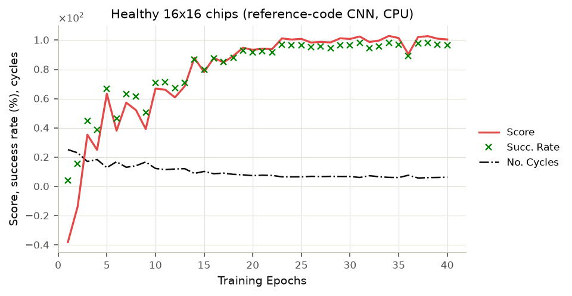
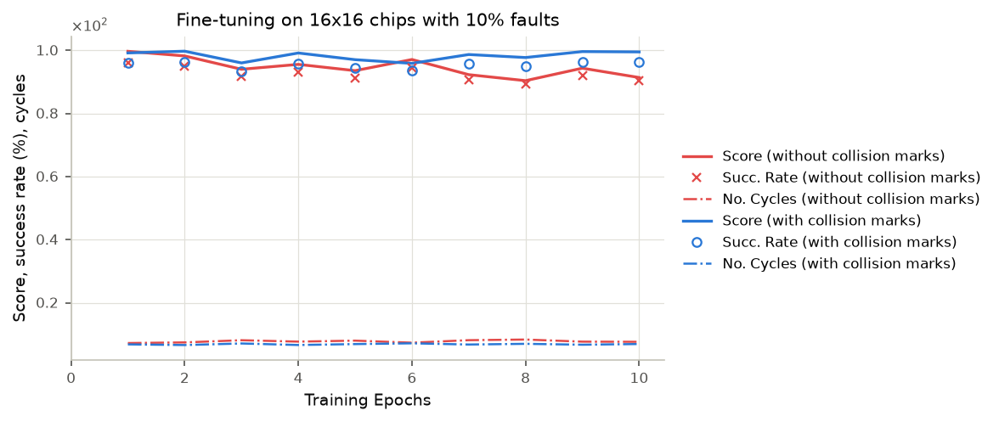

# Validation results

These results check that this reimplementation reproduces the base paper's
setup. A full-scale replication of the training curves (Figs. 4, 7, 8) and
of Fig. 9 needs GPU time. The authors trained on an RTX 6000. On the 4-core
CPU used here, one PPO minibatch step of the Table I CNN takes about 1 s, so
a single 2^14-step epoch takes about 35 min. The checks below are the ones
that fit on a CPU, and they are designed to be as informative as possible.

## 1. The authors' own trained agent in our environment

The first author's repository contains the trained model of the paper's
30×30 run (`policy/0825a_030x030_E100_NPS64_00.zip`, Table I CNN, August
2021) and its training log. `scripts/evaluate_reference_model.py` loads
those TensorFlow weights into PyTorch and runs the agent in
`MEDARoutingEnv` on 300 random jobs from the same job distribution
(`configs/training/reference_0825a_30x30.yaml`: healthy 30×30 chips,
4×4 … 6×6 droplets). The agent sees observations in its original encoding.

| | success rate | cycles / job | score |
|---|---|---|---|
| authors' log, converged (epochs 30–100) | 99.8–100% | ≈10.5 | ≈111.1 (IQR 110.9–111.2) |
| **authors' agent in this environment** (300 jobs) | **100%** | **10.00** | **110.55** |

The agent was never trained on our code. It succeeds on every job with the
same efficiency as in its own training log. So our environment reproduces
the original movement model, adaptive step (Algorithm 1), action semantics,
routing zones, job distribution and reward. A mismatch in any of these, such
as swapped axes, a different frontier definition or wrong step sizes, would
have broken the agent.

```bash
curl -L -o 0825a.zip https://media.githubusercontent.com/media/melfar87/MEDA/master/policy/0825a_030x030_E100_NPS64_00.zip
python scripts/evaluate_reference_model.py 0825a.zip --episodes 300
```

The jobs are drawn with reset seeds 10000, 10001, … (`--seed`).

## 2. Optimal-policy check of the reward and job distribution

On a healthy chip the adaptive shortest-path router is cycle-optimal. When
every step makes progress, an episode's score depends only on the start–goal
distance, not on the number of cycles.

- On the 300 jobs of §1, the shortest path scores **110.55** in **7.07**
  cycles per job. That is exactly the authors' agent's score, so the agent
  never makes a move that loses progress on these jobs.
- On 500 jobs (seeds 10000–10499), it scores **110.92** in **7.23** cycles.
  This lies inside the IQR of the authors' converged scores, so the job
  distribution matches too.

The authors' converged agent needs ≈10 cycles, not 7. The reward pays for
progress, not for speed, so their converged policy is not cycle-optimal.
Only the discount factor favours shorter paths.

```bash
python scripts/evaluate_reference_model.py --shortest-path --episodes 300   # and --episodes 500
```

## 3. Health-aware vs. health-agnostic routing (Sec. V-B / VI)

Setup: 30×30 chips (paper defaults), 20% sensed faults in 2×2 clusters, 5%
defects the health sensors cannot see, and the same 200 jobs and chips for
every router (`routers.compare_routers`):

```bash
meda compare --routers baseline formal --jobs 200 --seed 0 \
    --set env.fault_fraction=0.2 --set env.hidden_defect_fraction=0.05
# the same with --step-mode adaptive
```

| router | step | success rate | cycles (successful jobs) |
|---|---|---|---|
| Baseline: health-agnostic shortest path | single | 80.5% | 20.9 |
| Baseline | adaptive (Algorithm 1) | 80.0% | 13.5 |
| Formal: MDP-optimal on the sensed health map | single | 93.5% | 20.5 |
| Formal | adaptive | 92.5% | 12.8 |

Health-agnostic routing gets stuck in front of fully degraded frontiers, as
in Fig. 14(b)–(c). The health-aware formal strategy routes around the sensed
faults. Its remaining failures come from the hidden defects, which no
health-aware router can see. The adaptive step saves about a third of the
cycles at the same reliability. The DRL agent is designed to combine both:
health awareness and the adaptive step.

## 4. Bioassays (Fig. 9 setting)

Setup: COVID-RAT and COVID-PCR on the pre-aged 60×30 chip. The baseline and
formal routers use the double-step action set of the reference Fig. 9 driver.
The degradation regime is either the paper's Sec. V-A ranges or the fixed
`τ = 0.7, c = 200` the authors' bioassay runs actually used.
Commands: `meda bioassay --assay covid-rat --routers baseline formal --trials 30`
and `meda bioassay --assay covid-pcr --routers baseline formal --trials 15`
(seed 0, the default), each run once as is and once with
`--tau-range 0.7 0.7 --c-range 200 200` for the authors' regime. All trials
completed.

| assay | degradation | baseline, mean cycles | formal, mean cycles | paper, Fig. 9 (read off the plot) |
|---|---|---|---|---|
| COVID-RAT | Sec. V-A | 164.9 | 164.1 | |
| COVID-RAT | authors' runs | 207.4 | 209.1 | baseline ≈ 192–235, formal ≈ 190–230 |
| COVID-PCR | Sec. V-A | 601.5 | 608.4 | |
| COVID-PCR | authors' runs | 772.4 | 797.0 | baseline ≈ 775–830+, formal ≈ 720–800 |

In the authors' regime the baseline lands on the paper's timescale for both
assays. So the transcribed sequence graphs, the multi-droplet scheduler and
the physics reproduce the paper's bioassay setting. Our formal router
maximizes the probability of arriving within its horizon, so it pays for
reliability with slightly longer routes. The paper's PRISM-games strategies
were somewhat faster than its baseline. The DRL curve needs the
`covid_60x30` agent (see the README); training it on a CPU takes many hours.

## 5. Runtime (Sec. II-D, V-B)

| | this repository (1 CPU thread) | paper |
|---|---|---|
| DRL decision per control cycle (observation + Table I CNN) | 14.8 ms | < 0.1 s; required < 200 ms |
| formal strategy per routing job (60×30 chip, 4×4 droplet) | 0.08–0.10 s on average, 0.37 s max | 5–48 s with PRISM-games |

Our formal router solves the same single-droplet MDP with vectorized value
iteration. PRISM-games builds and solves a stochastic-game model from
scratch, which explains the gap. The paper's scalability argument against
formal synthesis concerns much larger chips and full bioassays.

## 6. Learning on a reduced problem (CPU)

A Table I run on 30×30 chips does not fit a CPU budget, so we checked the
learning pipeline on healthy 16×16 chips at native resolution
(`configs/training/validation_16x16.yaml`). The droplet sizes (2×2 … 6×6),
reward, PPO settings (except the value-loss weight, see the config) and
dynamic learning rate are the paper's. The network
is the reference code's smaller CNN (32/64/64 filters, FC 128). Training ran
40 epochs of 2^13 steps, evaluated on 300 jobs per epoch. That is about 50
minutes on 4 CPU cores (≈75 s per epoch).



The success rate climbs from 4% to 96–98% and the cycles per job drop from
25 to about 6, the same shape as the paper's Figs. 4 and 7.

Three 10-epoch fine-tunes then started from the best model (transfer
learning, Sec. IV-C):
- on chips with 10% faults;
- with the reference code's collision marks (IMPLEMENTATION_NOTES #12);
- with both, starting from the marks model.



Every router below saw the same 300 jobs and chips (seed 0). "Faulty" means
10% sensed faults plus 5% defects the sensors cannot see.

| router | healthy: success | healthy: cycles¹ | faulty: success | faulty: cycles¹ |
|---|---|---|---|---|
| DRL, trained on healthy chips | 96.0% | 5.2 | 91.7% | 6.2 |
| DRL, fine-tuned with collision marks | 99.0% | 4.8 | 94.0% | 6.0 |
| DRL, fine-tuned on 10% faults | 92.7% | 5.3 | 89.7% | 6.2 |
| DRL, fine-tuned on 10% faults with marks | 98.3% | 5.1 | 93.7% | 6.1 |
| Baseline, single step | 100% | 7.5 | 96.0% | 8.8 |
| Baseline, adaptive step | 100% | 4.5 | 95.3% | 5.4 |
| Formal, single step | 100% | 7.5 | 99.0% | 8.8 |
| Formal, adaptive step | 100% | 4.5 | 99.0% | 5.4 |

¹ mean over successful jobs.

- **The pipeline learns.** Starting from random weights, the agent routes
  96–99% of jobs on healthy chips. It needs 4.8–5.2 cycles per job, against
  4.5 for the cycle-optimal adaptive shortest path.
- **Collision marks fix a failure mode.** A deterministic policy fails by
  looping. After a blocked move the observation is unchanged, so the policy
  repeats the move until `k_max`. It can also bounce between a few
  positions. Replaying the first agent's 12 failures shows 11 such loops:
  5 repeat an invalid action and 6 cycle between two or three positions.
  The reference code's marks show which side of the droplet was blocked.
  After ten epochs of fine-tuning with them, 3 of 300 jobs fail. The
  fault-trained agent with marks takes no invalid action at all.
- **This budget does not beat the baselines on faulty chips.** The best DRL
  agents route 94% of the faulty jobs. The health-agnostic baseline routes
  95–96%, and the formal router, which solves the routing MDP exactly on the
  sensed health map, routes 99%. Fault fine-tuning did not help within ten
  epochs. The training budget here is a small fraction of the paper's
  (smaller network, half-length epochs, 10 fault epochs), so this is a
  pipeline check, not a replication of Sec. VI. It also sets the bar for new
  agents: the formal router with the adaptive step (99%, 5.4 cycles).

```bash
C=configs/training/validation_16x16.yaml
meda train -c $C
meda train -c $C --set name=validation_16x16_faults10 --set env.fault_fraction=0.1 \
    --set init_from=runs/validation_16x16/seed_0/best_model.zip --set schedule.epochs=10
meda train -c $C --set name=validation_16x16_marks --set env.mark_collisions=true \
    --set init_from=runs/validation_16x16/seed_0/best_model.zip --set schedule.epochs=10
meda train -c $C --set name=validation_16x16_marks_faults10 --set env.mark_collisions=true \
    --set env.fault_fraction=0.1 --set schedule.epochs=10 \
    --set init_from=runs/validation_16x16_marks/seed_0/best_model.zip
# one table row per model (add --set env.fault_fraction=0.1 --set env.hidden_defect_fraction=0.05
# for the faulty columns); baseline/formal rows: --routers baseline formal [--step-mode adaptive]
meda compare -c $C -m runs/validation_16x16/seed_0 --routers drl --jobs 300 --seed 0
```

The first run predates some later fixes. For example, evaluation jobs now
come from a random stream separate from the dynamics, and every epoch now
starts with fresh environments. A rerun therefore gives similar but not
identical curves. The progress logs of all four runs are in
`docs/figures/`. The README episode (`meda render`) shows the fault-trained
agent with marks.
